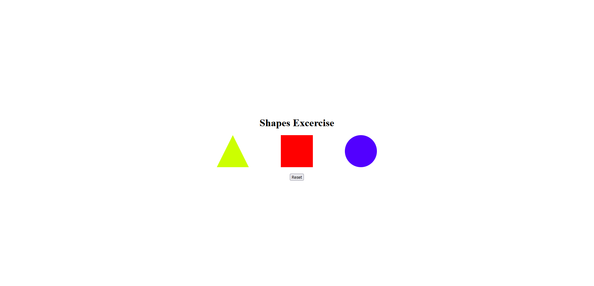

# shapes-excersise

Este ejercicio consiste en replicar la imagen que encontrarás haciendo click en el enlace proporcionado.

    https://www.figma.com/file/MDOOB6AuDlls68ru7hNLlM/Shapes-Exercise?node-id=0%3A1&authuser=0

### Requisitos:

    1. El conjunto de los elementos deberá estar centrado en el body tanto horizontalmente como verticalmente
    2. Al pasar el ratón encima de las figuras deben cambiar de color y moverse un poco hacia arriba
    3. Utilizando Javascript. Haciendo click de ratón sobre las figuras geométricas esas deben desaparecer
    4. Haciendo click en el botón "Reset" las figuras geométricas volverán a ser visibles

